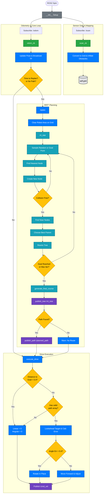

```mermaid
graph TD
    %% Custom Colors & Styles
    classDef init fill:#6c757d,stroke:#495057,stroke-width:2px,color:#fff;
    classDef callback fill:#28a745,stroke:#1e7e34,stroke-width:2px,color:#fff;
    classDef process fill:#007bff,stroke:#0056b3,stroke-width:2px,color:#fff;
    classDef algorithm fill:#17a2b8,stroke:#117a8b,stroke-width:2px,color:#fff;
    classDef decision fill:#ffc107,stroke:#d39e00,stroke-width:2px,color:#000;
    classDef publish fill:#6f42c1,stroke:#543290,stroke-width:2px,color:#fff;
    classDef data fill:#e2e3e5,stroke:#383d41,stroke-width:2px,color:#000;

    %% Setup
    Start([ROS2 Spin]) --> Init[__init__ Setup]:::init
    Init --> SubScan[Subscribe: /scan]
    Init --> SubOdom[Subscribe: /odom]
    
    %% Background Map Updater
    subgraph Map_Update [Sensor Data & Mapping]
        SubScan --> ScanCB[scan_cb]:::callback
        ScanCB --> MapCalc[Convert to Grid & Inflate Obstacles]:::process
        MapCalc -.-> GridMap[(self.grid)]:::data
    end

    %% Main Execution Loop (Driven by Odom)
    subgraph Main_Loop [Odometry & Core Loop]
        SubOdom --> OdomCB[odom_cb]:::callback
        OdomCB --> TFBroadcast[Update Pose & Broadcast TF]:::process
        TFBroadcast --> TimeCheck{Time to Replan? <br>or No Path?}:::decision
    end

    %% Replan & RRT* Logic
    subgraph Path_Planning [RRT* Planning]
        TimeCheck -- Yes --> ReplanCB[replan]:::process
        ReplanCB --> ClearStart[Clear Robot Area on Grid]:::process
        ClearStart --> RRTStart[rrt_star]:::algorithm
        
        RRTStart --> Sample[Sample Random or Goal Point]:::algorithm
        Sample --> Nearest[Find Nearest Node]:::algorithm
        Nearest --> Steer[Create New Node]:::algorithm
        Steer --> Collision{Collision Free?}:::decision
        Collision -- No --> Sample
        Collision -- Yes --> NearNodes[Find Near Nodes]:::algorithm
        NearNodes --> BestParent[Choose Best Parent]:::algorithm
        BestParent --> Rewire[Rewire Tree]:::algorithm
        Rewire --> GoalCheck{Goal Reached <br> or Max Iter?}:::decision
        
        GoalCheck -- No --> Sample
        GoalCheck -- Yes --> GenCourse[generate_final_course]:::algorithm
        
        GenCourse --> PubTree[publish_tree /rrt_tree]:::publish
        PubTree --> PathValid{Path Found?}:::decision
        PathValid -- Yes --> PubPath[publish_path /planned_path]:::publish
        PathValid -- No --> Warn[Warn: No Route]:::process
    end

    %% Motion Controller
    subgraph Execution [Drive Execution]
        TimeCheck -- No ----> ExecDrive
        PubPath --> ExecDrive[execute_drive]:::process
        Warn --> ExecDrive
        
        ExecDrive --> GoalReach{Distance to <br> Goal < 0.4?}:::decision
        GoalReach -- Yes --> StopCMD[Linear = 0 <br> Angular = 0]:::process
        GoalReach -- No --> PathFollow{Has valid <br> path array?}:::decision
        
        PathFollow -- Yes --> CalcLookahead[Lookahead Target & Calc Error]:::process
        CalcLookahead --> AlignCheck{Angle Err > 0.4?}:::decision
        AlignCheck -- Yes --> TurnCMD[Rotate in Place]:::process
        AlignCheck -- No --> FwdCMD[Move Forward & Adjust]:::process
        PathFollow -- No --> StopCMD
        
        StopCMD --> PubCMD[Publish /cmd_vel]:::publish
        TurnCMD --> PubCMD
        FwdCMD --> PubCMD
    end
```
