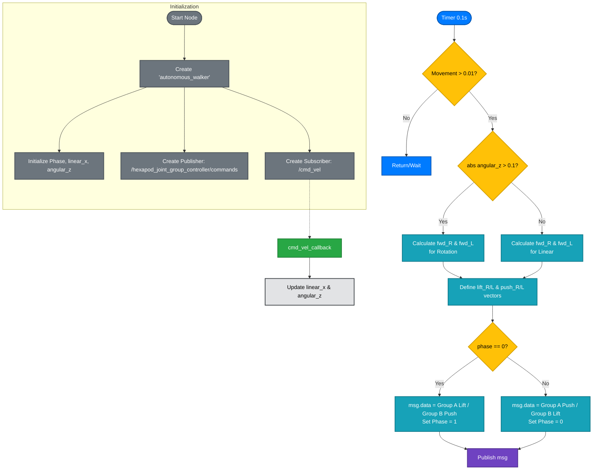

```mermaid
graph TD
    %% Node Initialization
    subgraph Initialization
        Start([Start Node]):::init --> NodeInit[Create 'autonomous_walker']:::init
        NodeInit --> Setup[Initialize Phase, linear_x, angular_z]:::init
        NodeInit --> PubObj[Create Publisher: /hexapod_joint_group_controller/commands]:::init
        NodeInit --> SubObj[Create Subscriber: /cmd_vel]:::init
    end

    %% Data Flow / Callbacks
    SubObj -.-> Callback[cmd_vel_callback]:::callback
    Callback --> UpdateData[Update linear_x & angular_z]:::data

    %% Processing Loop
    Timer([Timer 0.1s]):::process --> CheckMove{Movement > 0.01?}:::decision
    
    CheckMove -- No --> Idle[Return/Wait]:::process
    
    CheckMove -- Yes --> CalcDir{abs angular_z > 0.1?}:::decision

    %% Directional Math Logic
    CalcDir -- Yes --> RotLogic[Calculate fwd_R & fwd_L<br/>for Rotation]:::algorithm
    CalcDir -- No --> LinLogic[Calculate fwd_R & fwd_L<br/>for Linear]:::algorithm
    
    RotLogic --> JointCalc[Define lift_R/L & push_R/L vectors]:::algorithm
    LinLogic --> JointCalc

    %% Tripod Gait Phase Logic
    JointCalc --> PhaseCheck{phase == 0?}:::decision
    
    PhaseCheck -- Yes --> SetP1[msg.data = Group A Lift / Group B Push<br/>Set Phase = 1]:::algorithm
    PhaseCheck -- No --> SetP0[msg.data = Group A Push / Group B Lift<br/>Set Phase = 0]:::algorithm

    SetP1 --> Send[Publish msg]:::publish
    SetP0 --> Send

    %% Class Definitions
    classDef init fill:#6c757d,stroke:#495057,stroke-width:2px,color:#fff;
    classDef callback fill:#28a745,stroke:#1e7e34,stroke-width:2px,color:#fff;
    classDef process fill:#007bff,stroke:#0056b3,stroke-width:2px,color:#fff;
    classDef algorithm fill:#17a2b8,stroke:#117a8b,stroke-width:2px,color:#fff;
    classDef decision fill:#ffc107,stroke:#d39e00,stroke-width:2px,color:#000;
    classDef publish fill:#6f42c1,stroke:#543290,stroke-width:2px,color:#fff;
    classDef data fill:#e2e3e5,stroke:#383d41,stroke-width:2px,color:#000;
```
